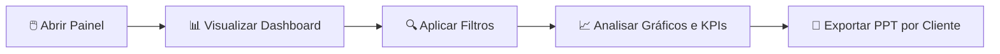
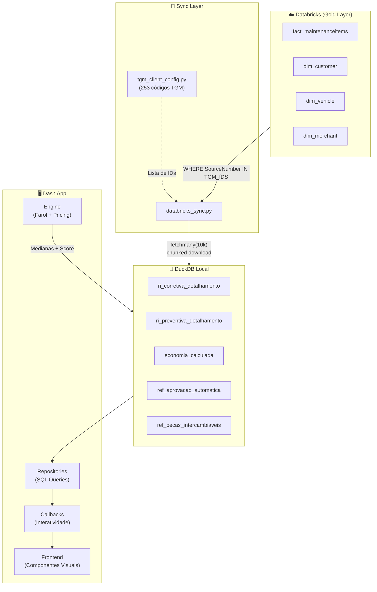
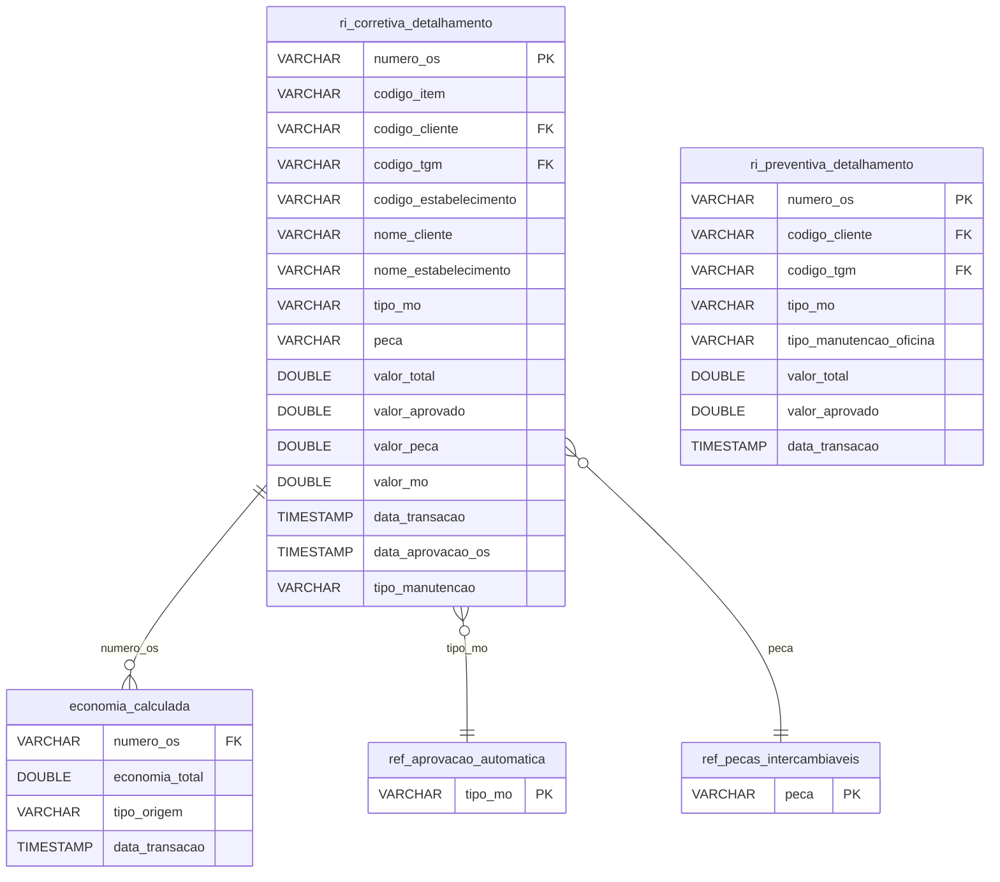
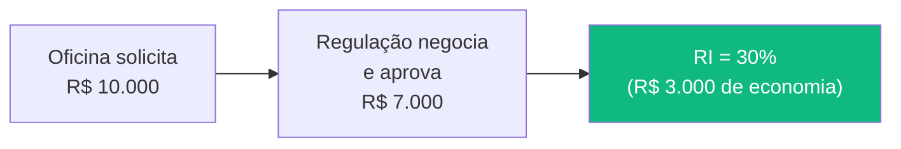
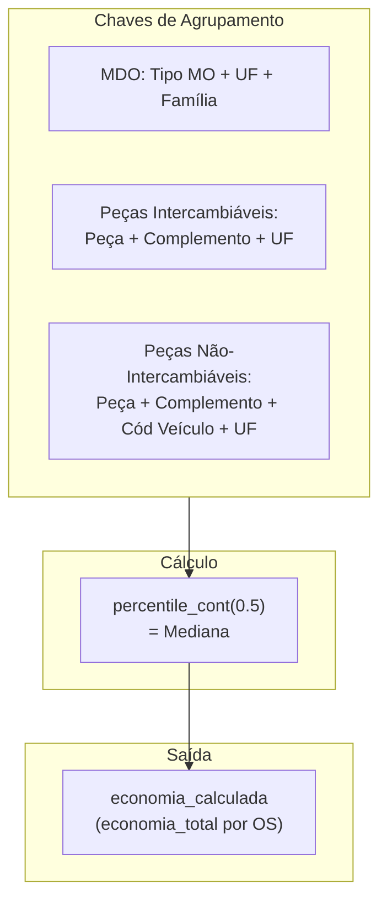
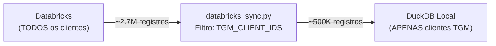
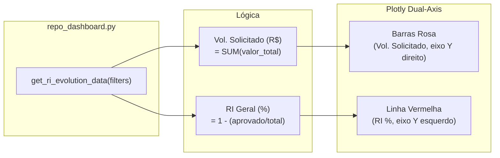
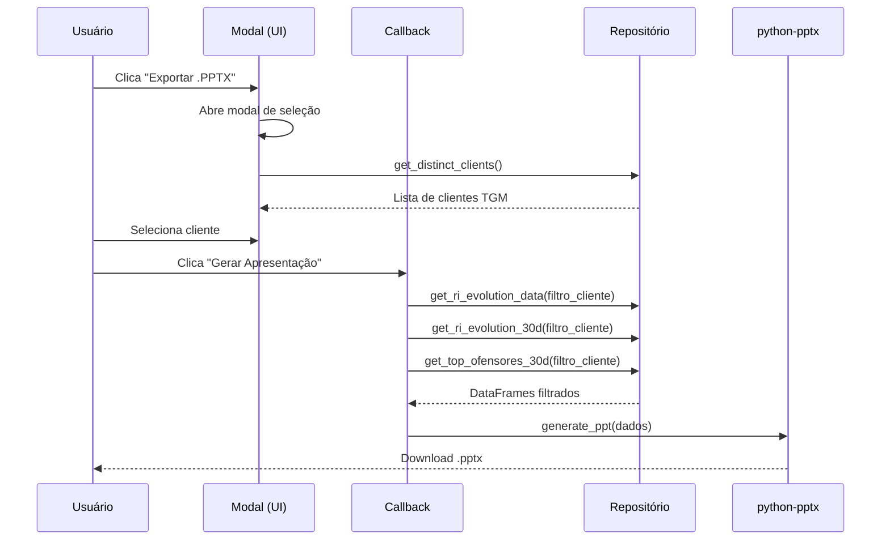
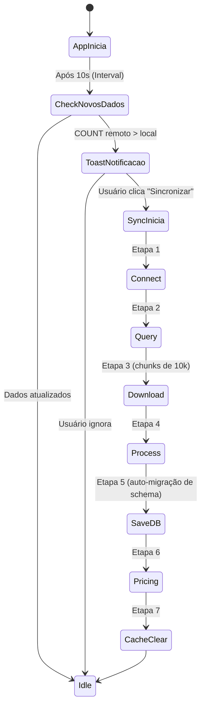

# 🚗 Painel de Regulação Inteligente (RI) — Edenred Repom

> **Corporate Analytics Solution** | _Databricks Apps Integration_

Aplicação de _Business Intelligence_ para otimização de custos de manutenção de frotas.<br/>
Monitora a Regulação Inteligente (RI) — indicador que mede o quanto a Edenred consegue reduzir nos orçamentos de manutenção veicular através de negociação com oficinas.

---

<!-- ======================================================================= -->
<!--                     VERSÃO EXECUTIVA (NÃO-TÉCNICA)                      -->
<!-- ======================================================================= -->

# 📋 Guia Executivo (Para Stakeholders e Analistas)

> _Se você não é da área técnica, esta seção é para você._

## O que o Painel faz?

O Painel RI é um **dashboard interativo** que mostra em tempo real a performance da regulação de custos de manutenção. Pense nele como um "painel de controle" de um avião — ele exibe métricas críticas de saúde financeira da operação.

### Funcionalidades Disponíveis

| Funcionalidade                          | O que faz                                                                   | Onde encontrar    |
| --------------------------------------- | --------------------------------------------------------------------------- | ----------------- |
| **Dashboard Principal**                 | Mostra a evolução do RI (%) mês a mês com gráfico de barras + linha         | Página inicial    |
| **KPIs Executivos**                     | Cards com métricas: RI Geral, Volume Solicitado, Economia, Qtd de OSs       | Topo do Dashboard |
| **Comparativo Corretiva vs Preventiva** | Gráfico de linhas comparando a eficiência entre os dois tipos               | Dashboard         |
| **Farol de Peças**                      | Tabela com sistema de cores (🟢🟡🔴) indicando a saúde de cada peça/serviço | Seção Farol       |
| **Fugas de Preventiva**                 | Identifica manutenções corretivas que deveriam ser preventivas              | Seção Preventiva  |
| **Exportação PPT**                      | Gera relatório executivo PowerPoint por cliente                             | Seção Relatórios  |
| **Filtros Globais**                     | Filtra por período, cliente e tipo de manutenção                            | Sidebar lateral   |
| **Sincronização**                       | Atualiza dados do Databricks com um clique                                  | Botão no Sidebar  |

### Glossário de Termos

| Termo                  | Significado                                                                                         |
| ---------------------- | --------------------------------------------------------------------------------------------------- |
| **RI (%)**             | Regulação Inteligente — percentual de economia obtido: `(Solicitado - Aprovado) / Solicitado × 100` |
| **OS**                 | Ordem de Serviço — uma solicitação de manutenção                                                    |
| **Corretiva**          | Manutenção para reparar algo que quebrou                                                            |
| **Preventiva**         | Manutenção programada para evitar quebras                                                           |
| **Fuga de Preventiva** | Uma manutenção lançada como Corretiva mas que tem características de Preventiva                     |
| **Farol**              | Sistema de cores que classifica a "saúde" de cada tipo de peça/serviço                              |
| **TGM**                | Código de agrupamento de clientes (1 TGM = vários estabelecimentos)                                 |
| **Ofensores**          | Estabelecimentos com o pior índice de RI (negociam menos)                                           |
| **Economia**           | Diferença entre o que a oficina pediu e o que foi efetivamente aprovado                             |

### Fluxo de Uso



---

<!-- ======================================================================= -->
<!--                     VERSÃO TÉCNICA (PARA DEVS)                          -->
<!-- ======================================================================= -->

# ⚙️ Documentação Técnica

## Arquitetura do Sistema



## Stack Tecnológico

| Camada                | Tecnologia                | Versão     |
| --------------------- | ------------------------- | ---------- |
| **Linguagem**         | Python                    | 3.10+      |
| **Framework Web**     | Dash (Plotly)             | 2.x        |
| **UI Components**     | Dash Bootstrap Components | 1.x        |
| **OLAP Engine**       | DuckDB                    | 1.x        |
| **Visualização**      | Plotly.js (via Dash)      | 5.x        |
| **Tabela Interativa** | Dash AG Grid              | Community  |
| **Export PPT**        | python-pptx               | 1.x        |
| **Hospedagem**        | Databricks Apps           | Serverless |

---

## Estrutura de Diretórios

```
painel-RI-DATABRICKS/
├── app.py                          # Entry point — Dash server + SimpleCache
├── database.py                     # DuckDB init, schema, conexões thread-safe
├── requirements.txt                # Dependências Python
│
├── backend/
│   ├── callbacks/                  # Callbacks interativos do Dash
│   │   ├── callbacks_sync.py       # Sync Databricks → DuckDB
│   │   ├── callbacks_reports.py    # Modal de exportação PPT
│   │   ├── dashboard_callbacks.py  # Atualização de charts e KPIs
│   │   └── callbacks_preventiva.py # Seção de Fugas
│   ├── repositories/               # Queries SQL (DuckDB)
│   │   ├── repo_base.py            # WHERE builder, helpers, safe_memoize
│   │   ├── repo_dashboard.py       # Evolução RI, Ofensores, Clientes
│   │   ├── repo_farol_table.py     # Tabela do Farol + Tendências
│   │   ├── repo_farol_chart.py     # Chart do Farol (itens fora auto-aprovação)
│   │   ├── repo_preventiva.py      # Fugas de Preventiva (regex DuckDB)
│   │   ├── repo_filters.py         # Dados para dropdowns de filtro
│   │   └── repo_logs_corretiva.py  # Queries legado (logs_corretiva)
│   ├── services/
│   │   ├── databricks_sync.py      # ETL Databricks → DuckDB
│   │   ├── tgm_client_config.py    # Lista de clientes TGM (253 IDs)
│   │   └── ppt/                    # Geração de relatório PowerPoint
│   │       ├── generate_ppt.py     # Orquestrador de slides
│   │       ├── slide_cover.py      # Slide 1 — Capa
│   │       ├── slide_kpis.py       # Slide 2 — KPIs Executivos
│   │       ├── slide_chart.py      # Slide 3 — Chart Evolução RI + Top 3 Ofensores
│   │       ├── config.py           # Cores, fontes, constantes visuais
│   │       └── helpers.py          # Funções auxiliares (shapes, headers)
│   └── cache_config.py             # SimpleCache (in-memory)
│
├── frontend/
│   ├── layout.py                   # Layout principal + Toast + Intervals
│   └── components/
│       ├── sidebar.py              # Sidebar com filtros e botão sync
│       ├── dashboard_charts.py     # Plotly charts (RI Geral, Comparativo)
│       ├── kpi_card.py             # Cards de KPI premium
│       ├── farol_section.py        # Interface do Farol
│       ├── farol_table.py          # Tabela AG Grid do Farol
│       ├── farol_cards.py          # Cards de resumo (Verde/Amarelo/Vermelho)
│       ├── preventiva_section.py   # Interface de Fugas
│       ├── preventiva_modal.py     # Modal de detalhes de Fugas
│       ├── reports_section.py      # Interface de Relatórios + Modal PPT
│       └── filters/                # Componentes de filtro reutilizáveis
│
├── engine/
│   ├── farol_engine.py             # Scoring do Farol (Verde/Amarelo/Vermelho)
│   └── pricing.py                  # Motor de medianas e economia
│
├── assets/                         # CSS, logos, favicon
├── data/                           # DuckDB database + snapshots JSON
├── scripts/                        # Scripts de deploy e manutenção
└── tests/                          # Testes unitários (pytest)
```

---

## Banco de Dados — Tabelas DuckDB

### Diagrama de Relacionamento



### Catálogo de Tabelas

| Tabela                       | Origem                                                     | Registros Típicos | Uso                                        |
| ---------------------------- | ---------------------------------------------------------- | ----------------- | ------------------------------------------ |
| `ri_corretiva_detalhamento`  | Databricks (fact_maintenanceitems WHERE tipo = CORRETIVA)  | ~500K–1.3M        | Dashboard RI, Farol, Ofensores, PPT        |
| `ri_preventiva_detalhamento` | Databricks (fact_maintenanceitems WHERE tipo = PREVENTIVA) | ~200K–500K        | Dashboard Comparativo, Fugas               |
| `economia_calculada`         | Gerada pelo Engine de Pricing                              | ~500K             | Cálculo real de economia (mediana)         |
| `ref_aprovacao_automatica`   | Hardcoded (database.py)                                    | 21 registros      | Farol: filtra itens fora da auto-aprovação |
| `ref_pecas_intercambiaveis`  | Hardcoded (database.py)                                    | ~150 registros    | Pricing: define chave de agrupamento       |
| `ref_clientes_tgfm`          | Config (tgfm_clients.py)                                   | 253 registros     | Filtro global de clientes                  |
| `logs_corretiva`             | Legado (sync Databricks)                                   | ~500K             | Queries legadas                            |
| `logs_regulacao_preventiva`  | Legado (sync Databricks)                                   | ~200K             | Queries legadas                            |

### Colunas Críticas

| Coluna           | Tabela               | Tipo      | Descrição                                               |
| ---------------- | -------------------- | --------- | ------------------------------------------------------- |
| `numero_os`      | Todas                | VARCHAR   | Identificador único da Ordem de Serviço                 |
| `codigo_cliente` | Todas                | VARCHAR   | ID granular do cliente (7 dígitos, ex: `6240480`)       |
| `codigo_tgm`     | Todas                | VARCHAR   | SourceNumber — agrupador TGM (5-6 dígitos, ex: `96853`) |
| `valor_total`    | Corretiva/Preventiva | DOUBLE    | Valor total orçado pela oficina                         |
| `valor_aprovado` | Corretiva/Preventiva | DOUBLE    | Valor efetivamente aprovado após regulação              |
| `data_transacao` | Corretiva/Preventiva | TIMESTAMP | Data de referência da transação                         |
| `tipo_mo`        | Corretiva/Preventiva | VARCHAR   | Tipo de mão de obra (ex: TROCA, REPARO, REVISAO)        |
| `peca`           | Corretiva            | VARCHAR   | Nome da peça utilizada                                  |

---

## Regras de Negócio

### 1. Cálculo do RI (%)

O indicador central do painel. Mede a eficiência de negociação da regulação.

```
RI (%) = (Valor Solicitado − Valor Aprovado) / Valor Solicitado × 100
```



> **Quanto maior o RI, melhor.** Significa que a Edenred consegue maiores reduções nos orçamentos.

### 2. Sistema de Farol (Scoring)

Classifica a "saúde" de cada combinação **Peça + Tipo MO** usando cores.

| Cor             | Condição                              | Ação                  |
| --------------- | ------------------------------------- | --------------------- |
| 🟢 **Verde**    | Aprovação ≥ 80%                       | Performance excelente |
| 🟡 **Amarelo**  | 50% ≤ Aprovação < 80%                 | Atenção necessária    |
| 🔴 **Vermelho** | Aprovação < 50% OU Score ≥ 70 + Queda | Ação urgente          |

**Fórmula do Score de Prioridade (0–100):**

```python
Score = (0.40 × Score_Aprovação)    # 40% peso
      + (0.30 × Score_Financeiro)   # 30% peso (P70)
      + (0.20 × Score_Volume)       # 20% peso
      + (0.10 × Score_Tendência)    # 10% peso (só quedas)
```

### 3. Motor de Pricing (Medianas)

Calcula valores de referência para comparação de preços.



### 4. Fugas de Preventiva

Identifica manutenções lançadas como **Corretivas** que possuem características de **Preventivas**.

**Termos de detecção** (regex case-insensitive):
`REVISAO | REVISÃO | PREVENTIVA | PREVENTIVO | CHECK-UP | CHECK UP | LUBRIFICACAO | LUBRIFICAÇÃO | INSPECAO | INSPEÇÃO`

**KPIs calculados:**

- Total de Fugas (contagem)
- % de Fuga: `(Total Fugas / Total Corretivas) × 100`

### 5. Aprovação Automática

A tabela `ref_aprovacao_automatica` lista 21 tipos de MO que podem ser pré-aprovados sem intervenção humana (ex: BALANCEAMENTO, LAVAGEM, LUBRIFICAÇÃO). Itens **fora** dessa lista são monitorados pelo Farol.

### 6. Filtro de Clientes TGM

Os dados já chegam filtrados do Databricks. O sync aplica `WHERE try_cast(c.SourceNumber AS INT) IN (...)` usando a lista de 253 códigos TGM definidos em `tgm_client_config.py`.



---

## Gráficos e Visualizações

### Chart 1: Evolução RI Geral (Dual-Axis)

**Arquivo:** `frontend/components/dashboard_charts.py` → `create_ri_geral_chart()`



| Elemento          | Tipo                         | Cor                   | Eixo           |
| ----------------- | ---------------------------- | --------------------- | -------------- |
| Volume Solicitado | `go.Bar`                     | `rgba(226,6,19,0.15)` | Y direito (R$) |
| RI Geral (%)      | `go.Scatter (lines+markers)` | `#E20613`             | Y esquerdo (%) |
| Meta RI           | `go.Scatter (dash line)`     | `#94a3b8`             | Y esquerdo     |

**Query base (simplificada):**

```sql
SELECT
    date_trunc('month', data_transacao) as mes_ref,
    COUNT(DISTINCT numero_os) as total_os,
    SUM(valor_total) as sum_total,
    SUM(valor_aprovado) as sum_aprovado
FROM ri_corretiva_detalhamento
WHERE data_transacao IS NOT NULL
GROUP BY 1
ORDER BY 1
```

### Chart 2: Corretiva vs Preventiva

**Arquivo:** `dashboard_charts.py` → `create_comparative_chart()`

| Elemento          | Tipo                         | Cor                     |
| ----------------- | ---------------------------- | ----------------------- |
| RI Corretiva (%)  | `go.Scatter (lines+markers)` | `#E20613` (Edenred Red) |
| RI Preventiva (%) | `go.Scatter (lines+markers)` | `#94a3b8` (Cinza)       |

**Lógica:** Compara a eficiência de regulação entre manutenções corretivas e preventivas lado a lado.

### Chart 3: Evolução Farol (Fora Auto-Aprovação)

**Arquivo:** `repo_farol_chart.py` → `get_ri_corretivas_chart()`

Mostra o montante (R$) mensal de OSs cujo `tipo_mo` **NÃO** está na tabela `ref_aprovacao_automatica`. Essas são as OSs que requerem análise manual.

**Query usa CTE:**

```sql
WITH tipos_auto AS (
    SELECT UPPER(TRIM(tipo_mo)) as tipo_mo_norm
    FROM ref_aprovacao_automatica
)
SELECT ...
    SUM(CASE WHEN NOT EXISTS (
        SELECT 1 FROM tipos_auto WHERE tipo_mo_norm = d.tipo_mo_norm
    ) THEN d.valor ELSE 0 END) as valor_fora_auto
FROM dados_base d
GROUP BY ano, mes_num
```

### Tabela: Farol de Peças (AG Grid)

**Arquivo:** `repo_farol_table.py` → `get_farol_table_data()`

Cada linha mostra uma combinação **Peça + Tipo MO** com:

- `pct_aprovacao`: % de aprovação
- `p70`: Percentil 70 do valor
- `qtd_os`: Volume de ordens
- `tendencia`: Delta % vs período anterior
- `farol_cor`: 🟢🟡🔴 (calculado pelo `farol_engine.py`)
- `sugestao`: Recomendação textual gerada

### Tabela: Fugas de Preventiva (AG Grid Master-Detail)

**Arquivo:** `repo_preventiva.py` → `get_fugas_grouped_with_detail()`

- **Master Grid:** Agrupa por `codigo_tgm` (SourceNumber) com totais
- **Detail Grid:** Ao expandir, mostra `IdCustomer` individuais (max 10)
- **Performance:** Usa `regexp_matches()` do DuckDB (single-pass, ~2s em 1.3M rows)

---

## Exportação PPT (Relatório Executivo)

### Fluxo



### Slides Gerados

| Slide | Conteúdo                              | Arquivo          |
| ----- | ------------------------------------- | ---------------- |
| 1     | Capa com logo Edenred e data          | `slide_cover.py` |
| 2     | KPIs Executivos (6 cards em grid 2×3) | `slide_kpis.py`  |
| 3     | Chart Evolução RI + Top 3 Ofensores   | `slide_chart.py` |

### Top 3 Ofensores

Estabelecimentos com o **pior** índice de RI nos últimos 30 dias:

```sql
-- Lógica: Menor RI = pior negociação
RI = economia / (aprovado + economia)
-- Ranqueado por: menor RI entre estabelecimentos com volume mínimo
ORDER BY ri_total ASC
LIMIT 3
```

---

## Fluxo de Sincronização de Dados



- **Timeout:** 600s (10 minutos)
- **CloudFetch:** Desabilitado (lento em rede corporativa)
- **Auto-Migração:** Detecta colunas faltantes e faz `ALTER TABLE ADD COLUMN`
- **Cache:** `SimpleCache` in-memory (morre com o processo)

---

## Guia de Desenvolvimento

### Setup Local

```bash
pip install -r requirements.txt
python app.py
# Acesse: http://127.0.0.1:8050/
```

### Padrões de Código

- **Repositórios:** Toda query SQL fica em `backend/repositories/`
- **Cache:** Usar `@safe_memoize(timeout=300)` em todas as queries
- **Filtros:** Usar `repo_base.py` para construir WHERE clauses
- **Charts:** Seguir o padrão de cores e layout do `chart_plotter.md`
- **Performance:** Prefer `regexp_matches()` sobre múltiplos `LIKE`

### Deploy (Databricks)

```powershell
.\scripts\deploy.ps1
```

---

## Segurança e Governança

- **Autenticação:** OAuth 2.0 (Databricks / Azure AD)
- **Dados:** Nenhum dado sensível é persistido no código. Os dados ficam no DuckDB local.
- **Filtering at Source:** Os dados são filtrados no Databricks antes de chegar ao app local.
- **Cache:** `SimpleCache` in-memory — dados morrem com o processo (zero dados fantasma).

---

© 2025–2026 Edenred Repom — Todos os direitos reservados.<br/>
_Desenvolvido pela equipe de entrega de resultados — Regulação Inteligente._
